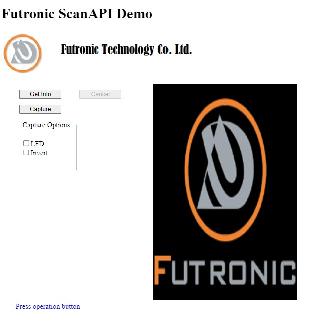
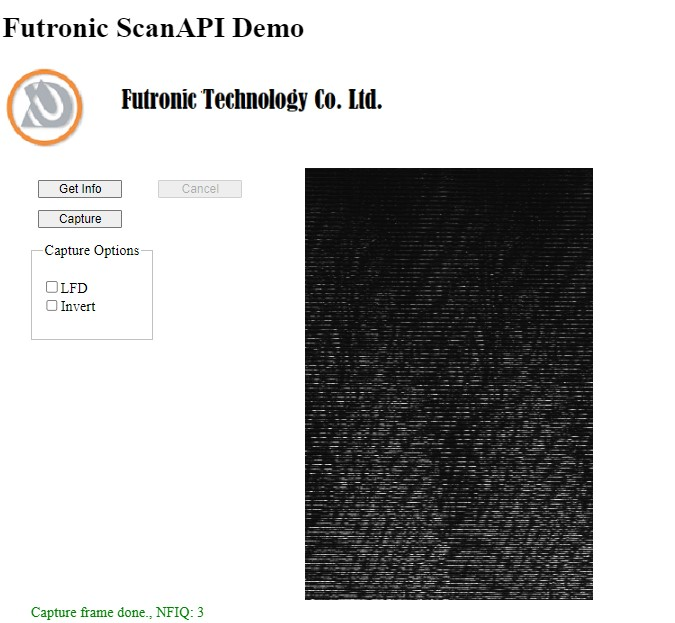

# Demo of Futronic FS50 Fingerprint Reader Web Solution

# Installation Windows 10 and 11 (it might work on other Windows versions)
1. Download and install "Setup_FtrScanHttpServer.msi" to access the Fingerprint Reader from a browser e.g Chrome.

2. Download the project and run/open index.html.